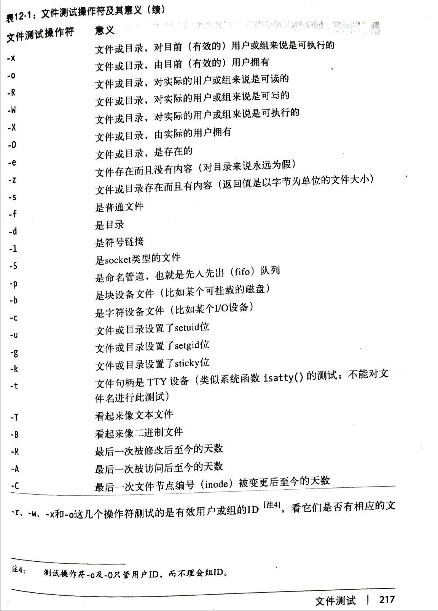

# 文件测试操作

有时候需要检查文件是否存在，如果open就会新建了
因此要引入 文件测试操作符
> 可以通过 命令 perldoc -f -X 查看

```
-e	查看是否存在
die "$filename alread exits.\n"  if  -e  $filename;			#检查文件是否存在，存在返回真 否则返回假

-M	查看最近一次修改到今天的天数
warn "File is too old"  if  -M   CONFIG > 28;				#返回值不是布尔，而是一个时间，上次修改到现在的天数

-A	查看最近一次访问 到今天的天数；
-s	查看文件大小（字节）
```

```perl
use 5.022;
my @original_file = qw/ fred barney betty wilma pebbles dino bamm-bamm/;
my @big_old_files;
foreach my $filename (@original_file){
	push my @bing_oldfiles,$filename
		if -s $filename > 100_000 and -A $filename > 90;		#如果文件大小大于100000字节， 超过90天没被访问，
}
```



```
-r				文件或目录 对 当前用户（有效的） 用户或用户组来说是可读的
-w				文件或目录 对 当前用户（有效的） 用户或用户组来说是可写的
```

注释：
1. -s	如果文件不为空，会返回文件大小， 当用作布尔判断时候，非0 也代表真
2. 文件时间操作符，-M   -A   -C	都是大写，分别会返回最后一次 被修改， 被访问， inode被修改后到现在的天数返回的天数是带小数的， 小数部分是 相对一天的 ， 比如0.5 就是 半天，  甚至有可能得到 负数（访问问题）
3. -T   -B	测试文件是文本文件还是二进制文件（Unix下面是通过猜测的），并不精确，是猜测的，不过基本够用。当文件为空时候，都会返回假
4. -t		如果测试的是一个TTY设备，对管道无效

如果直接写  -r， -w 后面不跟任何文件   那就是针对`$_`操作

```perl
foreach (@filearray) {
print "$_ is readable\n"   if  -r;			#直接针对 $_
}
```
但是 有陷阱：

```perl
my $size_in_K = -s / 1000;		#本意是想看 $_ 有多少个G，实际上， /被解析为文件了， 而不是除号
```

## 测试同一个文件的多个属性
### 虚拟句柄

```perl
if ( -r $file and -w $file) {......}			#测试一个文件 可 读写
#操作相当费资源，因为 一个文件信息要获取两次

if( -r $file and -w _ ) {...........}			#虚拟文件句柄， 当后面跟上 下划线 _  就不用再次读取硬盘了
#  下划线 _ 表示虚拟文件句柄， 存放了上一次查询过的文件信息
#   如果 中间 又查询了其他文件，就会保存新的文件，
# _ 可以看作一个全局变量， 哪怕是函数中修改了 _  也会影响所有地方的_
```


## 栈式文件测试

```perl
use 5.010;
if( -w -r $file){.......}			#5.010版本后才有，  从右向左执行（栈）

if(-r -w -x -o -d $file) {.....}	#对于复杂的测试，相当方便

if( -s -d $file < 512 ) {.....}		#对于处理 真假意外的事情就不要用这种
#被解析为  (-d $file and -s _) < 512,   明显错误
```

# stat  lsatat 函数，返回更多的文件信息

具体看 `stat` 的文档

```perl
my( $dev, $ino, $mode, $nlink, $uid, $gid, $rdev, $size, $atime, $ mtime, $ctime ,$blksize, $blocks)
=  stat($filename);				#stat函数返回一个列表，里面包含了信息
```

* `$dev $ino`		文件所在设备的编号 和文件的inode编号， 两个编号决定了文件的唯一性--->>>>两个编号的组合是唯一的
* $mode		权限集合， 类似  linux 的  -rwxr-xr-x
* $nlink		文件或目录的（硬）连接数，也就是这个目录有多少个真实名称。这个数值对目录来说总是2 或更大,对于文件是 1 后面会讲 连接
* $uid  $gid	用户id ，所属组id
* $size		文件大小（字节）
* $atime, $mtime  $ctime:3种时间戳，从1970年的世界标准 0时 到现在经过的 秒数,默认是 对 $_ 操作
 + localtime函数:
获得一个当前时间的时间戳 需要转化才能用

```perl
my $tiemstamp = 1180630098;		#获得当前时间戳，其实可以用 Time::Piece 模块
my $date = localtime $timestamp;		#转换时间戳，标量上下文中返回 一个 Thu May 31 00:00......这样的字符串

my( $sec, $min, $hour, $day, $mon, $year, $wday, $yday, $isdst) = localtime $timestamp;
			#列表上下文中的函数返回值对应的东西
```
